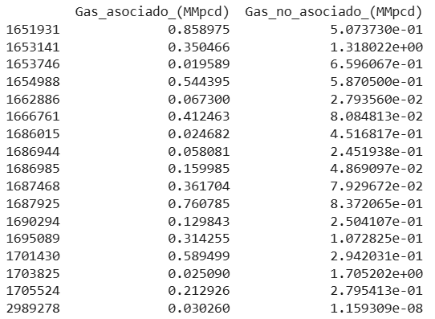
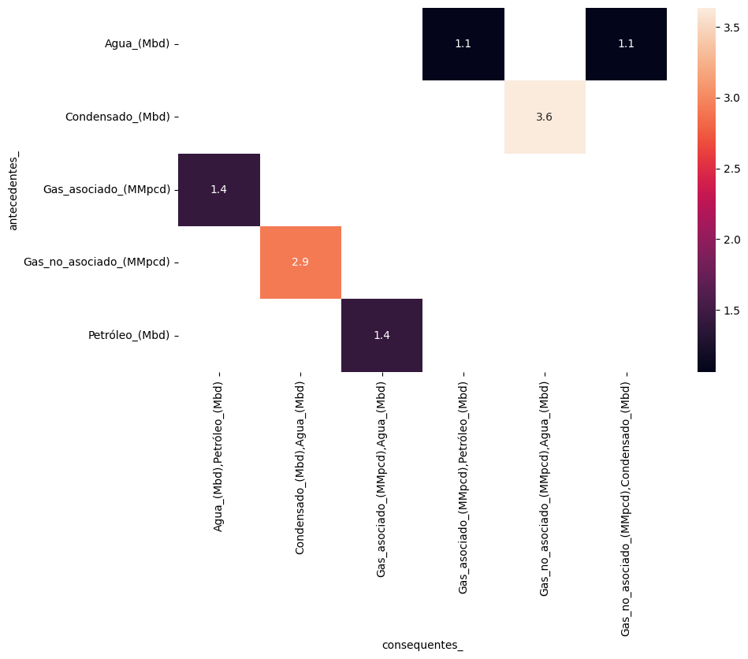

# Análisis Market Basket Aplicado a Producción petrolera
Se trata de un archivo .ipynb, visible en Colab o Jupyter, donde usando librerías como mlxtend, se analiza la asociación entre la presencia de un fluído y otro.

Si bien se sabe de la teoría y la práctica que un mismo yacimiento no produce, por ejemplo gas asociado y no asociado al mismo tiempo, en los registros de datos, ya sea por error o por algún caso específico, si se encuentran registros con estas condiciones, 
pero del análisis se espera identificar los patrones reales. 

# Procesamiento de datos

Los datos son obtenidos del Sistema Nacional de Información de Hidrocarburos, con un total de 3,322,014 de filas, donde cada una se correspone a un registro de producción de algun pozo.

Para los fines de este análisis, donde lo que se busca es encontrar los conjuntos en que se presentan los fluídos de los pozos, los datos se agrupan por pozo, obteniendo la suma total de producción de cada pozo.

Una vez agrupado, se obtiene una nueva sabana de datos, donde cada fila se refiere a un pozo y las columnas a la producción de cada tipo de fluído, de esta se modifican todos los registros diferentes de cero por unos. 

Esta última sábana, pasa por un onehot encoder para obtener la matriz booleana que se analizará. 

# Resultados
Se comprueba lo que se sabe:
- Los pozos con producción de petróleo implican la producción de agua y gas asociado,
- La producción de gas no asociado va acompañada de trazas de condensado y agua,

Comprobándose la pertinencia del modelo para identificar patrones de asociación. 

# Fuentes
-Sistema de Información de Hidrocarburos https://sih.hidrocarburos.gob.mx/
-https://rasbt.github.io/mlxtend/

